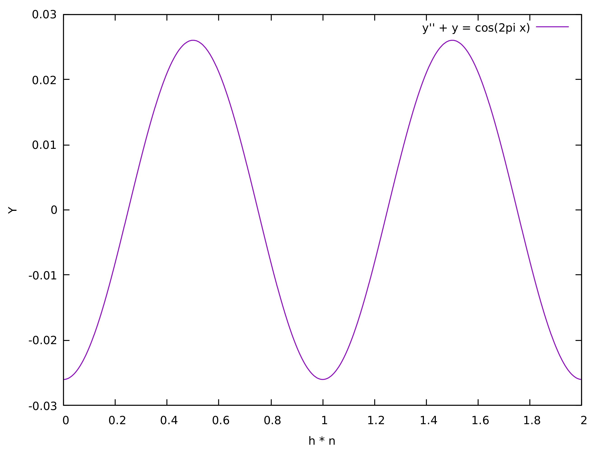

# Sherman Morrison solver

## Metoda

Zadanie polega na rozwiązaniu układu równań z macierzą prawie trójdiagonalną $A'$, z dodatkowymi elementami: w prawym górnym rogu (pierwszy wiersz, ostatnia kolumna) oraz w lewym dolnym rogu (ostatni wiersz, pierwsza kolumna). W naszym przypadku macierz $A'$ wygląda następująco:

$$
A' = \begin{pmatrix}
-\frac{2}{h^2} + 1 & \frac{1}{h^2} & 0 & \cdots & 0 & \frac{1}{h^2} \\
\frac{1}{h^2} & -\frac{2}{h^2} + 1 & \frac{1}{h^2} & \cdots & 0 & 0 \\
0 & \frac{1}{h^2} & -\frac{2}{h^2} + 1 & \cdots & 0 & 0 \\
\vdots & \vdots & \vdots & \ddots & \vdots & \vdots \\
0 & 0 & 0 & \cdots & -\frac{2}{h^2} + 1 & \frac{1}{h^2} \\
\frac{1}{h^2} & 0 & 0 & \cdots & \frac{1}{h^2} & -\frac{2}{h^2} + 1
\end{pmatrix}
$$

Do rozwiązania zastosowano wzór Shermana-Morrisona, który jest efektywny dla tego typu modyfikacji macierzy.

Macierz $A'$ można przedstawić jako:

$$
A' = A + u v^T
$$

gdzie A to macierz trójdiagonalna, a wektory $u$ i $v$ są zdefiniowane w naszym przypadku jako:

$$
u = v = 
\begin{bmatrix}
1 \\
0 \\
\vdots \\
0 \\
1/h^2
\end{bmatrix}
$$

Ostatnie elementy wektorów $u$ i $v$ (ostatni wiersz) odpowiadają dodatkowym elementom w prawym górnym oraz lewym dolnym rogu macierzy $A'$.

Następnie rozwiązujemy dwa układy równań przy użyciu algorytmu Thomasa:

$$
A z = b, \quad A q = u
$$

gdzie $b$ ma postać w naszym przypadku:

$$
b =
\begin{bmatrix}
1 \\
\cos(2\pi h) \\
\cos(4\pi h) \\
\vdots \\
\cos(2\pi hN)
\end{bmatrix}
$$

przy $N = 1000$ i $h = \frac{2}{N+1}$.

Po wyznaczeniu wektorów $z$ i $q$, obliczamy:

$$
y = z - \frac{v^T z}{1 + v^T q} q
$$

gdzie wektor $y$ stanowi poszukiwane rozwiązanie układu równań.

## Wyniki

Poniżej przedstawiono przykładowe wyniki dyskretyzacji równania $y'' + y = \cos(2\pi x)$ przy użyciu schematu:

$$
y''(x_n) + y(x_n) = \cos(2\pi x_n), \quad x_n = n h, \quad y_n = y(x_n)
$$

gdzie $h = \frac{2}{N+1}$, a $x \in [0, 2)$.

Uwzględniono warunek periodyczny: $n + (N+1) \equiv n$.

Pierwsza kolumna zawiera wartości $x$, a druga wartości $y$. Punkty te posłużyły do wykreślenia poniższego wykresu. Wszystkie wyniki znajdują się w pliku `metoda.txt`.

```
0 -0.0259889
0.001998 -0.0259869
0.003996 -0.0259808
0.00599401 -0.0259705
...
1.28072 0.00498517
1.28272 0.00530497
1.28472 0.00562393
...
1.99201 -0.0259562
1.99401 -0.0259705
1.996 -0.0259808
1.998 -0.0259869
```

## Wykres



## Analiza wykresu

Oś $x$ reprezentuje punkty $x_n = n h$, gdzie $h = \frac{2}{N+1}$, $n = 0, 1, \dots, N$, oraz $x \in [0, 2)$.

Oś $y$ przedstawia rozwiązanie równania różniczkowego:

$$
y'' + y = \cos(2\pi x)
$$

które w naszym programie prowadzi do rozwiązania zapisanego w postaci:

$$
y = z - \frac{v^T z}{1 + v^T q} q
$$

Wykres jest okresowy na przedziale $x \in [0, 2)$, a jego okres wynosi 1. Na początku funkcja przyjmuje wartości ujemne, następnie rośnie do wartości dodatnich, by później znów spadać do wartości ujemnych, a ten schemat powtarza się cyklicznie.

## Program, optymalizacja

Zadanie zaimplementowano w języku C++ z wykorzystaniem biblioteki GNU Scientific Library (GSL) do obliczeń wektorowych oraz obliczeń trygonometrycznych. Algorytm Shermana-Morrisona zastosowano do rozwiązania układu równań z macierzą niemal trójdiagonalną. Zastosowanie algorytmu Thomasa dla fragmentów z macierzami trójdiagonalnymi pozwoliło obniżyć złożoność obliczeniową z $O(n^3)$ do $O(n)$. Aby zachować tę efektywność, macierz $A$ przechowywana jest w trzech wektorach zamiast w tablicy $n \times n$, unikając tym samym złożoności $O(n^2)$. Podsumowując, program osiąga złożoność obliczeniową $O(n)$.

